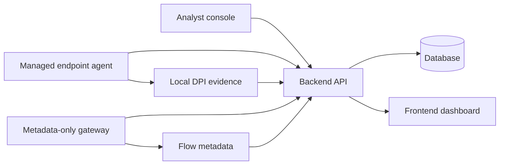

# Agent and Gateway Flow

NetVisor uses two collection paths:

- the **agent** path for managed endpoints
- the **gateway** path for metadata-only BYOD visibility

## Flow Overview

## Managed Endpoint Path

- The agent runs on an owned endpoint.
- It captures richer endpoint context and can run local DPI evidence collection when policy allows it.
- It authenticates to the backend with the agent API key and signed local credentials.

## Gateway Path

- The gateway is for metadata-only collection on non-managed traffic.
- It should not store payloads in the backend.
- It authenticates separately from the agent and uses its own signed credential state.

## Evidence Grouping

- Browser evidence is grouped by page URL, page title, content ID, browser name, and process name.
- The UI keeps grouped evidence separate from raw browser sessions so analysts can see both the rollup and the underlying events.
- The backend keeps the grouping logic stable so multi-tab traffic does not collapse into a single undifferentiated row.

## Operational Boundaries

- Managed-device DPI stays local to the endpoint.
- BYOD stays metadata-only.
- Shared code belongs in `shared/` only when both runtimes truly need it.
